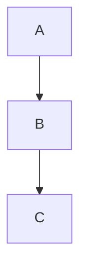

intro

# My Documentation

## Table of Contents

This section will have a permalink: `#table-of-contents`.

## Highlighting

==This text is highlighted== for emphasis.

## Admonitions

!!! note
This is an important note.

!!! warning
Be cautious with this.

## Collapsible Content

??? example "Expand for more details"
Here is some collapsible content.

## Tabs

=== "Option 1"
This is content for the first tab.
=== "Option 2"
This is content for the second tab.

## Mermaid Diagram

```mermaid
graph TD;
    Start-->Stop;


---

### **Why Use These Extensions?**
1. **Improved Readability:**
   - Use highlights, tabs, and admonitions to guide users' attention.
2. **Interactive Features:**
   - Collapsible sections (`details`) and Mermaid diagrams make your docs dynamic.
3. **Professional Look:**
   - Tables, permalinks, and advanced code blocks improve the overall quality.
4. **Developer-Friendly:**
   - Mermaid integration and code block enhancements make API and technical docs easier to follow.

Let me know if you’d like help setting up specific features or troubleshooting!
```


