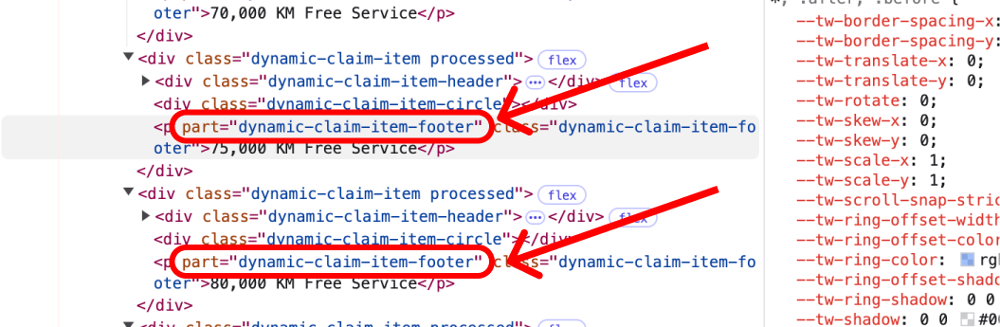

# Theming

ADP Component styles can be customized by targeting each element inside the component which gives flexibility to developers to apply their custom themes from any project.

## ADP Components

ADP Components are web components created from [StencilJS](https://stenciljs.com/) project and enables shadow dom feature making the component not effected by most of outside styles.

## What is Web Components?

[Web Components](https://developer.mozilla.org/en-US/docs/Web/API/Web_components) are a set of native browser technologies that allow developers to create reusable, encapsulated, and modular custom elements for web applications. They provide a standardized way to build and use UI components across different frameworks, libraries, or even vanilla JavaScript, ensuring better reusability and maintainability.

## What is Shadow DOM?

The [Shadow DOM](https://developer.mozilla.org/en-US/docs/Web/API/Web_components/Using_shadow_DOM) is a web standard that allows developers to encapsulate a component's structure, style, and behavior, preventing it from being affected by styles or scripts outside the component and vice versa. It is part of the Web Components specification.

## How to style

Developers can target each element inside the components using `part::` selector in CSS.

lets consider our imaginary `custom-element` has the following structure.

```html
<div part="custom-element">
  <div part="custom-element-header"></div>

  <div part="custom-element-body">
    <p part="custom-element-number"></p>
  </div>

  <div part="custom-element-footer"></div>
</div>
```

Custom styling example.

```html
<style>
  part(custom-element-header) {
    color: yellow !important;
  }

  #red::part(custom-element-header) {
    color: red !important;
  }

  .green::part(custom-element-header) {
    color: green !important;
  }
</style>

<body>
  <custom-element></custom-element>
  <custom-element id="red"></custom-element>
  <custom-element class="green"></custom-element>
  <custom-element class="green"></custom-element>
</body>
```

## How to find part names

Developers can find parts in 2 ways

- Each Component in their dedicated documentation has **Structure** section where their structure is showed similar to the above structure.
- Developers can explore the components and find out what is each element part names using [browser devtools](https://developer.mozilla.org/en-US/docs/Learn_web_development/Howto/Tools_and_setup/What_are_browser_developer_tools), as showed in the bellow image.



## Next Steps

- Read to the [Component List](components/components-list.md) for detailed documentation.
